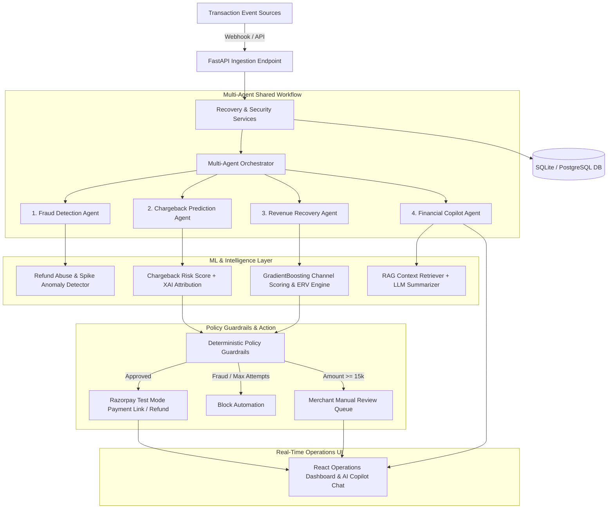

# RevenueShield AI — Autonomous AI Revenue Protection & Recovery Platform

"Detect. Decide. Recover. Measure."

[](https://razorpay.com)
[](https://python.org)
[](https://fastapi.tiangolo.com)
[](https://react.dev)
[](https://scikit-learn.org)
[](LICENSE)

An autonomous AI-powered revenue protection platform designed for **Razorpay** merchants. RevenueShield AI proactively predicts pre-dispute chargeback risk with Explainable AI (XAI), detects refund abuse anomalies, orchestrates multi-agent recovery workflows, enforces financial policy guardrails, and provides an AI Financial Copilot (RAG + LLM) for merchant Q&A.

---

## Key Features & Platform Capabilities

### 1. AI Chargeback Prediction Engine (XAI)
- **Pre-Dispute ML Model:** Predicts chargeback risk scores ($0–100\%$) before disputes occur using trained `GradientBoostingClassifier` models.
- **Explainable AI (XAI) Risk Factors:** Pinpoints key contributing risk drivers:
  - *First-time customer status*
  - *High transaction value ($\ge$ ₹15,000)*
  - *Multiple failed payment attempts*
  - *Unusual purchase patterns / risk flags*

### 2. Fraud & Refund Abuse Detection System
- **Anomaly Detection:** Identifies malicious customer behavior and refund abuse:
  - **Refund Abuse:** Flags accounts requesting $> 3$ refunds within a short timeframe.
  - **Duplicate Refunds:** Intercepts identical refund attempts on the same payment.
  - **Refund Spikes:** Triggers critical alerts if daily refunds exceed $3\times$ historical baseline.

### 3. AI Financial Copilot (RAG + LLM)
- **Interactive Merchant Chat:** Answers complex financial and operational questions:
  - *"Why did revenue decrease?"*
  - *"Which customers are high risk?"*
  - *"What refunds look suspicious?"*
  - *"What revenue is recoverable?"*
- **RAG & Multi-Agent Synthesis:** Pulls real-time database context, metrics, and audit logs to generate actionable business insights and suggested recovery actions.

### 4. Multi-Agent Shared Workflow
- **Coordinated Intelligence:**
  - `FraudAgent`: Scans velocity, duplicate refunds, and anomaly risk.
  - `ChargebackAgent`: Predicts dispute probabilities and attributes risk factors.
  - `RecoveryAgent`: Scores channel ERVs (Email / WhatsApp / Voice) and executes outreach.
  - `CopilotAgent`: Answers business Q&A and generates strategic insights.

### 5. Deterministic Policy Guardrail Engine
- **Financial Safety Principles:** *"AI recommends. Policy validates. System executes. Human approves."*
- **Policies Enforced:**
  - `HighValueApprovalPolicy`: Intercepts cases $\ge$ ₹15,000 for merchant manual review.
  - `FraudRiskPolicy`: Immediately blocks outreach for high/critical fraud risk.
  - `MaximumAttemptsPolicy`: Enforces max 3 recovery attempts per case.
  - `QuietHoursPolicy`: Mutes voice calls between 21:00 and 09:00 IST.

### 6. Deepened Razorpay Integration
- Integrated Razorpay Payments, Orders, Refunds, and Webhooks APIs with HMAC SHA256 signature verification.
- **100% Mock Mode Fallback:** Runs completely offline without requiring live API keys or external tunnels.

---

## High-Level System Architecture



---

## Quickstart & Local Setup

### Prerequisites
- Python 3.11+
- Node.js 18+

### 1. Clone Repository
```bash
git clone git@github.com:varunsainadh/revenue-shield-ai.git
cd revenue-shield-ai
```

### 2. Start Backend Server
```bash
cd backend
python -m venv .venv
# On Windows PowerShell:
.\.venv\Scripts\Activate.ps1
# On Linux/macOS:
source .venv/bin/activate

pip install -r requirements.txt
uvicorn app.main:app --reload --port 8000
```
- **Backend API Docs (Swagger):** `http://localhost:8000/docs`
- **Backend Health Check:** `http://localhost:8000/api/health`

### 3. Start Frontend Operations Dashboard
In a new terminal window:
```bash
cd frontend
npm install
npm run dev
```
- **Frontend Dashboard:** `http://localhost:3000`

---

## ML Model Training & Evaluation

```bash
# 1. Regenerate 1,000 synthetic payment & refund dataset records (Seed: 42)
python scripts/generate_dataset.py

# 2. Train scikit-learn classifiers (Email, WhatsApp, Voice) & save artifacts
python scripts/train_model.py

# 3. Evaluate ML model metrics & ERV yields
python scripts/evaluate_model.py

# 4. Run automated Pytest test suite (18/18 tests passing)
cd backend && pytest
```

---

## Folder Structure

```
RevenueShield/
├── README.md                              # Main Documentation
├── LICENSE                                # MIT License
├── architecture.md                        # Architectural specification & Mermaid diagrams
├── backend/
│   ├── pytest.ini                         # Pytest configuration
│   ├── requirements.txt                   # Backend dependencies
│   ├── model_metrics.json                 # Machine-readable ML evaluation metrics
│   ├── models_ml/                         # Trained ML model pipeline artifacts
│   └── app/
│       ├── main.py                        # FastAPI application entry point
│       ├── config.py                      # Pydantic BaseSettings environment config
│       ├── database.py                    # SQLAlchemy ORM engine & Session setup
│       ├── domain/                        # Domain models & state machines
│       ├── models/                        # SQLAlchemy database models
│       ├── schemas/                       # Pydantic validation schemas
│       ├── services/                      # Business logic service layer
│       ├── agents/                        # Multi-agent orchestrator & Copilot RAG
│       ├── ml/                            # Chargeback XAI & Fraud Anomaly Detector
│       ├── api/                           # REST API routers
│       └── tests/                         # Pytest test suite (18 tests)
├── frontend/                              # Vite + React + Tailwind CSS Dashboard
│   ├── src/
│   │   ├── components/
│   │   ├── pages/                         # Overview, Copilot, Cases, Chargebacks, FraudAlerts...
│   │   └── services/                      # API service module
├── data/                                  # Synthetic datasets
├── scripts/                               # Workflow & ML scripts
└── docs/                                  # Demo scripts & evaluation reports
```

---

## License

This project is licensed under the **MIT License**.
