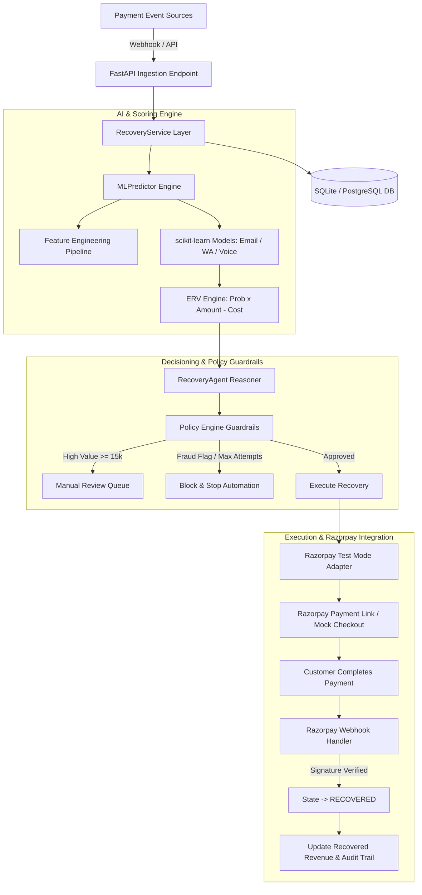
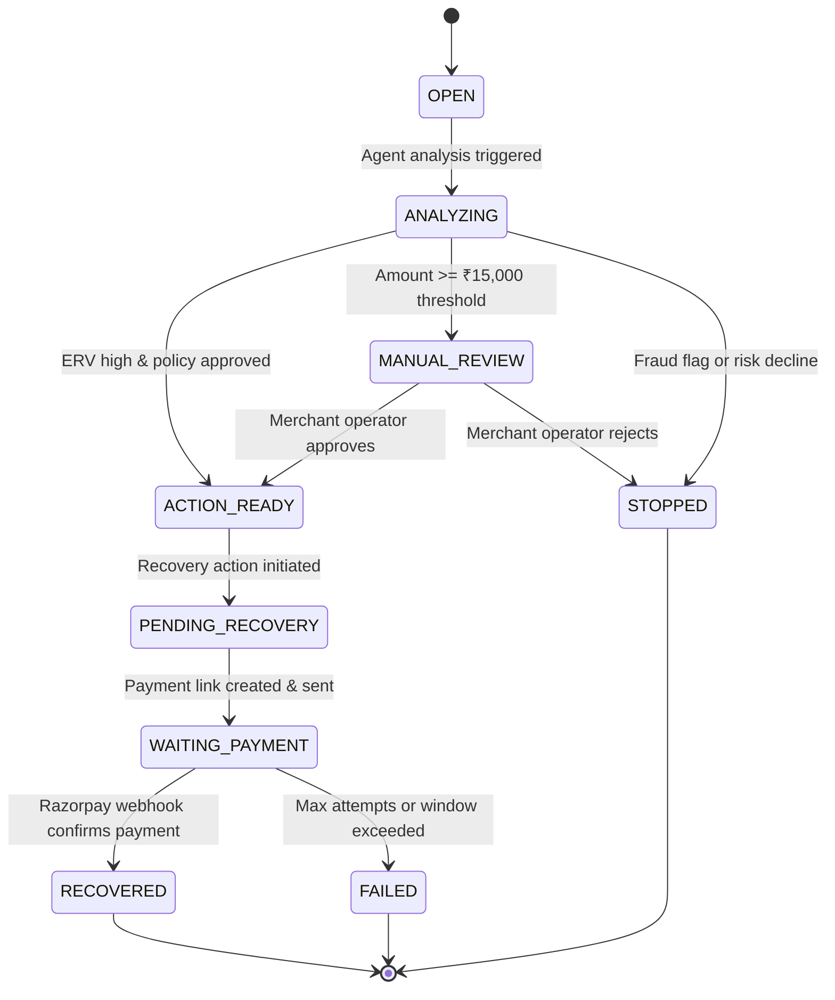
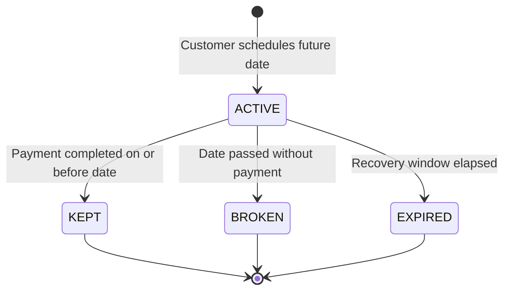
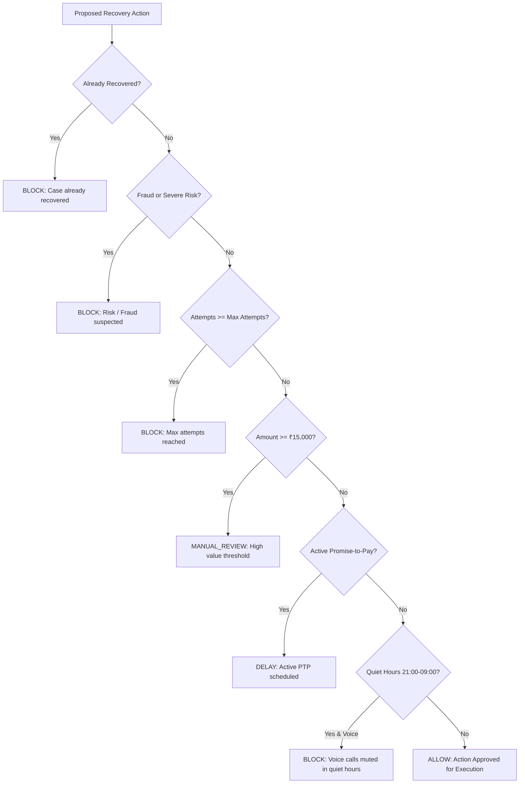
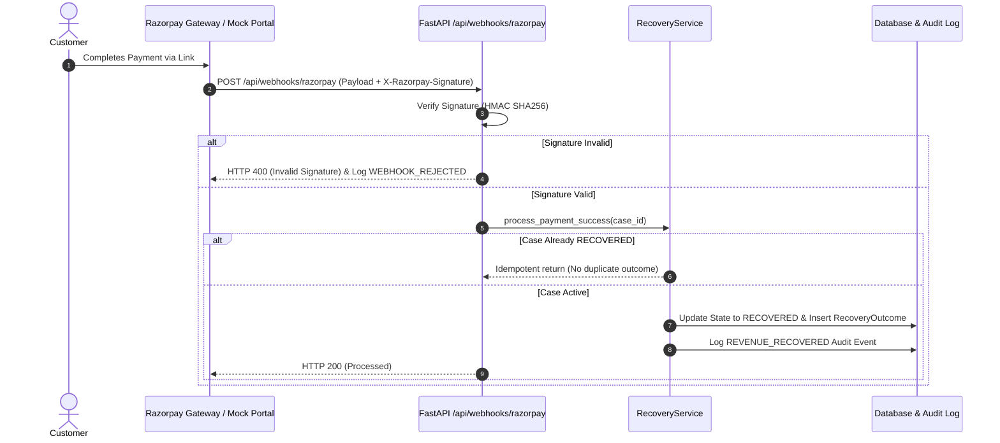
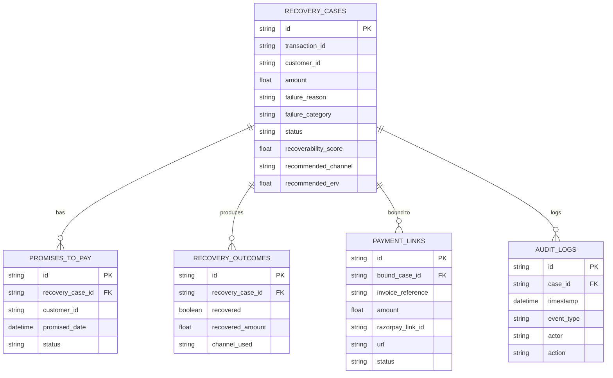

# RevenueShield AI — System Architecture & Design Specification

"Detect. Decide. Recover. Measure."  
**Razorpay AI Buildathon — Track 3 — AI Revenue Recovery**

---

## 1. High-Level System Architecture

---

## 2. Recovery Case State Machine

---

## 3. Promise-to-Pay (PTP) State Machine

---

## 4. Policy Engine Flowchart

---

## 5. Razorpay Webhook Signature & Idempotency Flow

---

## 6. Database Entity-Relationship Diagram

